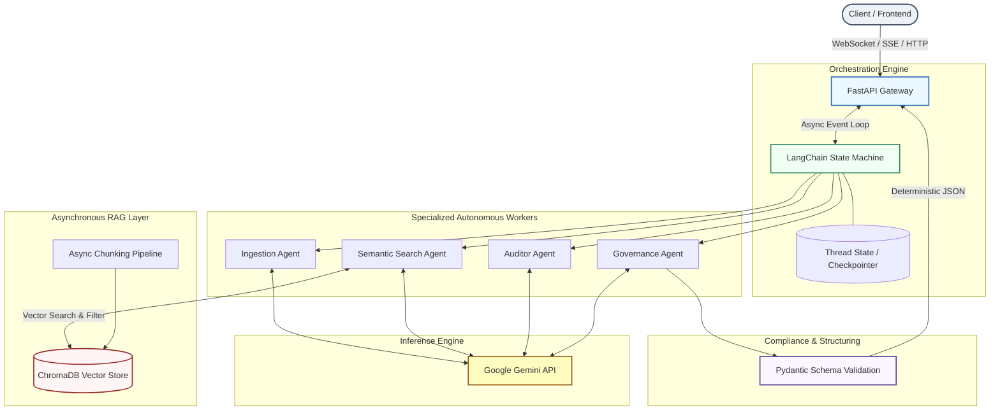

# OmniScribe AI — Autonomous Regulatory Due Diligence & Audit Platform

OmniScribe AI is an enterprise-grade, autonomous multi-agent platform designed to automate complex corporate compliance, legal due diligence, and regulatory auditing workflows. By merging high-performance asynchronous retrieval architectures with state-machine-controlled multi-agent orchestration, OmniScribe AI ingests massive volumes of raw corporate documentation, validates it against volatile regulatory frameworks, and yields deterministic, schema-enforced risk assessment reports.

The system features a modular architecture built from the ground up to unify low-latency semantic document grounding with bounded agentic workflows, ensuring safety, determinism, and extreme traceability.

---

## 🏛️ System Architecture

OmniScribe AI utilizes an event-driven, fully asynchronous architecture. Multi-agent tasks flow through an explicit state machine, preventing context drift and ensuring strict evaluation loops.



---

## ✨ Key Features

* **Agentic RAG Flow**: Embedded autonomous query optimization and recursive retrieval. If initial context semantic scores fall below custom thresholds, the *Search Agent* automatically expands, reformulates, or relaxes filter criteria until comprehensive regulatory backing data is localized.
* **State-Machine Multi-Agent Coordination**: Eliminates chain-of-thought hallucination and non-deterministic agent loops by enforcing rigorous DAG (Directed Acyclic Graph) state boundaries via LangChain.
* **Real-Time Asynchronous Streaming**: Utilizing FastAPI and Python's native `asyncio`, the platform streams active agent steps, inner thoughts, and incremental auditing logs straight to the frontend over WebSockets or Server-Sent Events (SSE).
* **Strict Structural Enforcement**: Eliminates text-parsing post-processing vulnerabilities. Leveraging Gemini’s native `Structured Outputs` mapping directly into complex `Pydantic` schemas, the final audit delivery is guaranteed to align with expected frontend JSON structures.
* **Cross-Framework Extensibility**: Modular codebase designed to seamlessly swap underlying embedding strategies, chunking metrics, or target compliance specifications.

---

## 📂 Project Structure

```text
omniscribe-ai/
├── .env.example
├── README.md
├── requirements.txt
├── src/
│   ├── __init__.py
│   ├── main.py                 # FastAPI Application Entrypoint & WebSocket Routers
│   ├── agents/                 # Multi-Agent Orchestration Core
│   │   ├── __init__.py
│   │   ├── graph.py            # LangChain State Machine Graph Definition
│   │   ├── state.py            # State Schema Definition
│   │   └── workers/            # Specialized Agent Node Implementations
│   │       ├── ingestion.py
│   │       ├── search.py
│   │       ├── auditor.py
│   │       └── governance.py
│   ├── rag/                    # Internal Context & Retrieval Engine
│   │   ├── __init__.py
│   │   ├── chroma_client.py    # Asynchronous Vector DB Manager
│   │   ├── embeddings.py       # Embedding Processing Interface
│   │   └── pipeline.py         # Document Splitting, Ingestion, & Chunking Logic
│   └── schemas/                # Strict Pydantic Contracts
│       ├── __init__.py
│       └── audit.py            # Compliance and Risk Assessment Schemas
└── tests/                      # Pytest Suite for Agents and Pipeline Benchmarks

```

---

## 🛠️ Tech Stack

* **Language & Runtime**: Python 3.11+ | Asyncio (Native Coroutines)
* **API Framework**: FastAPI | Uvicorn (High-performance ASGI server)
* **Agent Orchestration**: LangChain (State Graph Management)
* **Vector Database**: ChromaDB (Semantic Storage & Querying)
* **LLM Foundation**: Google Gemini API (`gemini-1.5-pro` & `gemini-1.5-flash`)
* **Data Validation**: Pydantic v2 (Strict Typing & Functional Serialization)

---

## 🚀 Getting Started

### Prerequisites

* Python 3.11 or higher
* Access to a Google AI Studio account (Gemini API Key)

### Installation

1. Clone the repository:

```bash
   git clone [https://github.com/yourusername/omniscribe-ai.git](https://github.com/yourusername/omniscribe-ai.git)
   cd omniscribe-ai

```

2. Create and activate a virtual environment:

```bash
   python -m venv venv
   source venv/bin/activate  # On Windows use: venv\Scripts\activate

```

3. Install required dependencies:

```bash
   pip install -r requirements.txt

```

### Configuration

Create a `.env` file in the root directory by copying the example template:

```bash
cp .env.example .env

```

Populate your credentials:

```env
# Application Settings
APP_ENV=development
HOST=0.0.0.0
PORT=8000

# LLM Providers
GEMINI_API_KEY=your_google_gemini_api_key_here

# Vector Storage Configuration
CHROMADB_HOST=localhost
CHROMADB_PORT=8000
VECTOR_COLLECTION_NAME=regulatory_compliance_vault

```

### Running the Application

Launch the FastAPI gateway server via Uvicorn:

```bash
uvicorn src.main:app --reload --host 0.0.0.0 --port 8000

```

Access the interactive API documentation at:

* **Swagger UI**: [http://localhost:8000/docs](https://www.google.com/search?q=http://localhost:8000/docs)
* **ReDoc**: [http://localhost:8000/redoc](https://www.google.com/search?q=http://localhost:8000/redoc)

---

## 🧪 Example API Usage

### Initiate an Audit Session

Submit corporate documents for execution against specific regulatory guidelines.

**Endpoint**: `POST /api/v1/audit/initiate`

**Payload**:

```json
{
  "document_id": "doc_contract_94820_2026",
  "document_url": "[https://storage.enterprise.internal/contracts/vendor_agreement.pdf](https://storage.enterprise.internal/contracts/vendor_agreement.pdf)",
  "regulatory_frameworks": ["LGPD", "ISO27001"],
  "strictness_level": "high"
}

```

**Response**:

```json
{
  "session_id": "aud_sess_77c83bb2-311a",
  "status": "QUEUED",
  "websocket_stream_url": "ws://localhost:8000/api/v1/audit/stream/aud_sess_77c83bb2-311a",
  "created_at": "2026-06-05T21:00:00Z"
}

```

### Real-time Event Streaming Schema

Connecting to the `websocket_stream_url` emits standard Pydantic event packets detailing execution milestones:

```json
{
  "event": "agent_execution_step",
  "agent": "AuditorAgent",
  "status": "PROCESSING",
  "meta": {
    "clause_under_review": "Section 9.2: Data Retention Polices",
    "retrieved_reference": "LGPD Art. 16 - Elimination of personal data boundaries"
  }
}

```

---

## 📜 License

This project is licensed under the MIT License — see the [LICENSE](https://www.google.com/search?q=LICENSE) file for details.
