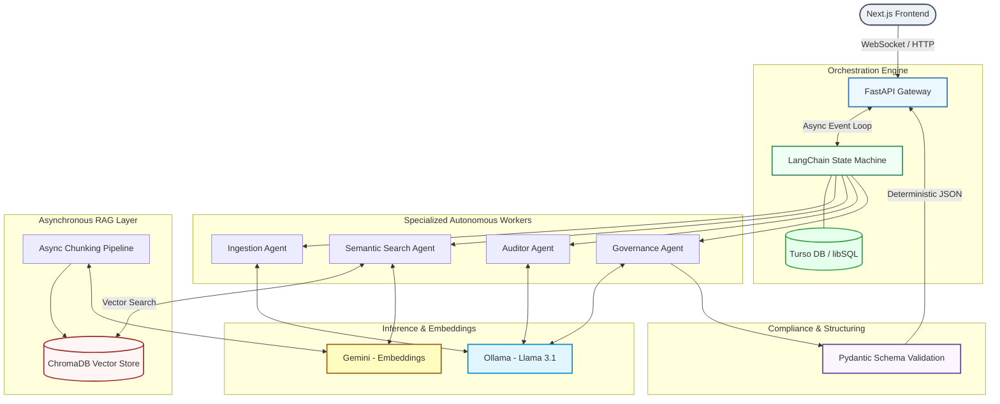

# OmniScribe AI — Autonomous Regulatory Due Diligence & Audit Platform

OmniScribe AI is an enterprise-grade, autonomous multi-agent platform designed to automate complex corporate compliance, legal due diligence, and regulatory auditing workflows. By merging high-performance asynchronous retrieval architectures with state-machine-controlled multi-agent orchestration, OmniScribe AI ingests raw corporate documentation, validates it against volatile regulatory frameworks, and yields deterministic, schema-enforced risk assessment reports.

The system features a modular architecture built from the ground up to unify low-latency semantic document grounding with bounded agentic workflows, ensuring safety, determinism, data privacy via local inference, and extreme traceability.

---

## 🏛️ System Architecture

OmniScribe AI utilizes an event-driven, fully asynchronous architecture. Multi-agent tasks flow through an explicit state machine, preventing context drift and ensuring strict evaluation loops.



---

## ✨ Key Features

* **Data Privacy First (Local Inference)**: Auditing agents run on local LLMs (Ollama + Llama 3.1), ensuring highly sensitive corporate contracts never leave the internal network during the critical analysis phase.
* **Agentic RAG Flow**: Embedded autonomous query optimization and recursive retrieval. The *Search Agent* localizes comprehensive regulatory backing data using Google Gemini's advanced text-embedding models.
* **State-Machine Multi-Agent Coordination**: Eliminates chain-of-thought hallucination and non-deterministic agent loops by enforcing rigorous DAG (Directed Acyclic Graph) state boundaries via LangGraph, persisted securely in the cloud via Turso DB.
* **Real-Time Asynchronous Streaming**: Utilizing FastAPI and Python's native `asyncio`, the platform streams active agent steps, inner thoughts, and incremental auditing logs straight to the React frontend over WebSockets.
* **Strict Structural Enforcement**: Eliminates text-parsing post-processing vulnerabilities. Leveraging native structured outputs mapping directly into complex `Pydantic` schemas, the final audit delivery is guaranteed to align with expected frontend JSON structures.

---

## 📂 Project Structure

```text
omniscribe-ai/
├── docker-compose.yml
├── .env
├── README.md
├── frontend/                   # Next.js Application
│   ├── src/
│   │   ├── app/                # React Server Components & Routing
│   │   └── components/         # UI Elements & Dashboards
│   ├── Dockerfile
│   └── package.json
└── backend/                    # FastAPI Application
    ├── Dockerfile
    ├── requirements.txt
    ├── src/
    │   ├── main.py             # FastAPI Entrypoint & WebSocket Routers
    │   ├── agents/             # Multi-Agent Orchestration Core
    │   │   ├── graph.py        # LangChain State Machine Graph Definition
    │   │   ├── state.py        # State Schema Definition
    │   │   └── workers/        # Specialized Agent Nodes (Ingestion, Auditor, etc.)
    │   ├── database/           # Persistence Layer
    │   │   └── turso_saver.py  # Custom LangGraph libSQL Checkpointer
    │   ├── rag/                # Retrieval-Augmented Generation Engine
    │   │   ├── chroma_client.py
    │   │   ├── embeddings.py
    │   │   └── pipeline.py
    │   └── schemas/            # Strict Pydantic Contracts
    └── tests/                  # Pytest Suite

```

---

## 🛠️ Tech Stack

| Layer | Technology | Purpose |
| --- | --- | --- |
| **Frontend** | Next.js (React), Tailwind CSS | Client interface and real-time WebSocket dashboard |
| **Backend API** | FastAPI, Uvicorn, Asyncio | High-performance asynchronous event-driven server |
| **Orchestration** | LangGraph, LangChain | State machine coordination for multi-agent workflows |
| **Inference (LLM)** | Ollama (Llama 3.1) | Local, privacy-preserving analytical reasoning |
| **Embeddings** | Google Gemini (`text-embedding-004`) | Multilingual semantic vector representation |
| **Vector Database** | ChromaDB | Semantic document storage and context retrieval |
| **State DB** | Turso (libSQL) | Distributed, low-latency checkpointing and audit history |
| **Validation** | Pydantic v2 | Deterministic schema enforcement and typing |

---

## 🚀 Getting Started

### Prerequisites

* Docker and Docker Compose
* Google AI Studio Account (Gemini API Key)
* Turso DB Account (Database URL & Auth Token)
* Ollama installed locally (if not running containerized GPU environments)

### Environment Configuration

Create a `.env` file in the root directory:

| Variable | Description | Example |
| --- | --- | --- |
| `GEMINI_API_KEY` | Google API key for embedding generation | `AIzaSy...` |
| `TURSO_DATABASE_URL` | Remote libSQL database connection string | `libsql://your-db.turso.io` |
| `TURSO_AUTH_TOKEN` | Authentication token for Turso DB | `ey...` |
| `OLLAMA_BASE_URL` | Endpoint for the local Ollama instance | `http://host.docker.internal:11434` |
| `VECTOR_COLLECTION_NAME` | ChromaDB internal collection name | `omniscribe_vault` |

### Deployment (Docker Compose)

The easiest way to run the entire OmniScribe AI ecosystem is via Docker Compose, which seamlessly builds and links the frontend and backend networks.

1. Clone the repository and configure your `.env` file.
2. Start the local Ollama service and pull the required model:
```bash
ollama serve
ollama pull llama3.1

```


3. Boot the application cluster:
```bash
docker-compose up --build

```


* **Frontend Dashboard**: `http://localhost:3000`
* **Backend API Docs**: `http://localhost:8000/docs`

---

## 🧪 Example API Usage

### Initiate an Audit Session

Submit corporate documents for execution against specific regulatory guidelines via a `multipart/form-data` request.

**Endpoint**: `POST /api/v1/audit/initiate`

**cURL Example**:

```bash
curl -X POST "http://localhost:8000/api/v1/audit/initiate" \
  -F "document_id=VENDOR_AGREEMENT_2026" \
  -F "regulatory_frameworks=LGPD" \
  -F "strictness_level=high" \
  -F "file=@/path/to/contract.pdf"

```

**JSON Response**:

```json
{
  "session_id": "8b9a3f2c",
  "status": "QUEUED",
  "websocket_stream_url": "/api/v1/audit/stream/8b9a3f2c"
}

```

### Real-Time Event Streaming

Connecting to the provided WebSocket URL emits standard JSON event packets detailing execution milestones:

```json
{
  "event": "agent_execution_step",
  "agent": "AuditorAgent",
  "status": "PROCESSING",
  "message": "Cross-referencing contractual clauses with local laws via local LLM.",
  "timestamp": "2026-06-07T04:57:00Z"
}

```

---

## 📜 License

This project is licensed under the MIT License — see the `LICENSE` file for details.